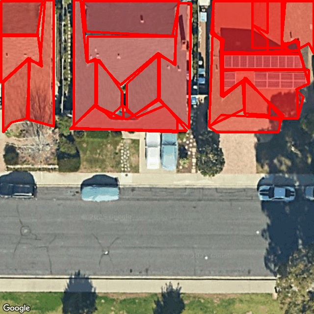
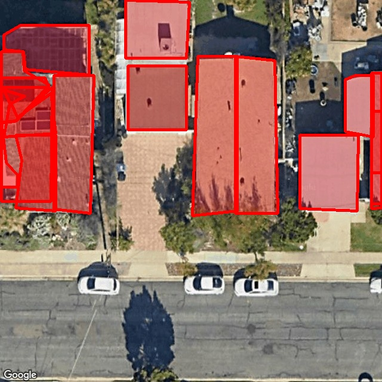
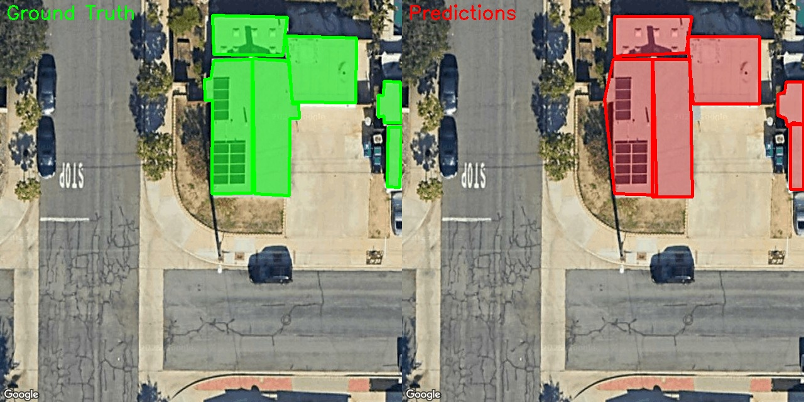
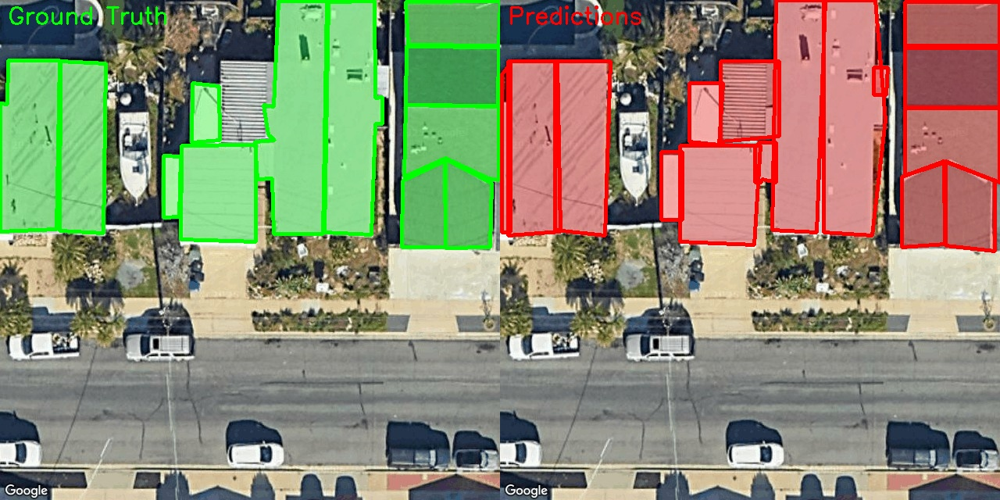

# Roof Tile Detection 
This project implements a YOLOv8 segmentation model for detecting roof tiles (flat surfaces) in satellite images. The model identifies polygonal roof sections to capture the instance masks and then converts the instance masks into a Polygon with approximations using openCV as a post-processing step to extract the key points.
## 1. Setup Instructions

### Environment Setup
1. **Create Virtual Environment** (recommended):
   ```bash
   python -m venv venv
   source venv/bin/activate  
   ```

2. **Install Dependencies**:
   ```bash
   pip install -r requirements.txt
    ```
## 2. How to Run Training and Validation Scripts

### Individual Script Execution

#### Data Processing
```bash
python data_processing.py --augmentation_factor 10
```
- Processes the dataset and converts annotations to YOLO format
- Creates train/validation splits
- Applies extensive data augmentation (to increase dataset size)
- Generates `outputs/dataset.yaml` configuration file along with labels required by YOLO.

#### Training
```bash
python train.py
```
- Trains YOLOv8 segmentation model
- Uses configuration from `config.py`
- Saves best model weights to `outputs/yolo_training/weights/best.pt`

#### Evaluation
```bash
python evaluate.py
```
- Evaluates trained model on validation and test sets
- Calculates metrics: Precision, Recall, F1-score, mIoU
- Generates evaluation results and visualizations
- Outputs results to `outputs/` directory

### Automated Pipeline (Prefered)

For convenience, use the automated pipeline to run all steps sequentially:

```bash
python pipeline.py --augmentation_factor 10
```

This pipeline automatically:
1. Processes the data with specified augmentation factor
2. Trains the YOLOv8 model
3. Evaluates the model performance
4. Generates all outputs and metrics

### Configuration

Modify training parameters in `config.py`:
- `EPOCHS`: Number of training epochs (default: 50)
- `BATCH_SIZE`: Training batch size (default: 32)
- `LEARNING_RATE`: Learning rate (default: 0.001)
- `MODEL_SIZE`: YOLOv8 model variant ('n', 's', 'm', 'l', 'x')
- `IMGSZ`: Input image size (default: 640)

## 3. Detailed Approach Overview

### Problem Formulation
This task is approached as an **instance segmentation problem** where each roof tile is represented as a polygon with variable number of vertices. The challenge is to detect individual roof segments (flat surfaces) from satellite imagery that can vary significantly.Instead of traditional bounding box detection, this approach captures the precise geometric shape of roof surfaces through instance masks and converts them to polygons using contour approximation.

### Model Architecture & Design Choices

#### Core Architecture
- **Base Model**: YOLOv8s Segmentation (YOLOv8s-seg)
- **Input Resolution**: 640×640 pixels (optimal balance between detail and efficiency)
- **Architecture**: Single-stage detector with integrated segmentation head

#### Why YOLOv8 Segmentation?
1. **Unified Architecture**: Single model handles both detection and segmentation
2. **Real-time Performance**: Essential for practical deployment
3. **Transfer Learning**: Pre-trained COCO weights provide good feature representations
4. **Instance Segmentation**: Directly outputs pixel-level masks for each roof tile
5. **Variable Object Count**: Handles images with different numbers of roof tiles

### Data Processing Pipeline

#### 1. Annotation Format Conversion
- **Input**: Keypoint annotations in normalized coordinates (0-1 range)
- **Challenge**: Convert variable-length keypoint lists to YOLO segmentation format
- **Solution**: Create polygon masks from keypoints and convert to YOLO's segmentation annotation format


### Training Strategy & Optimization

#### Transfer Learning Approach
- **Initialization**: Pre-trained YOLOv8s-seg weights
- **Fine-tuning**: Adopted full finetuning strategy on the custom dataset.


#### Loss Function Components
1. **Classification Loss**: Focal loss for class prediction
2. **Regression Loss**: IoU-based loss for bounding box regression  
3. **Segmentation Loss**: Binary cross-entropy for pixel-wise masks
4. **Combined Loss**: Weighted sum optimizing all three objectives simultaneously

### Post-Processing Pipeline

#### Mask-to-Polygon Conversion
1. **Mask Extraction**: Get binary masks from model predictions
2. **Contour Detection**: Use OpenCV to find mask contours
3. **Polygon Approximation**: Douglas-Peucker algorithm for vertex reduction
4. **Coordinate Normalization**: Convert to normalized coordinates (0-1 range)


### Evaluation Framework

#### Custom Metrics for Polygon Matching
- **Polygon IoU**: Shapely-based geometric intersection calculation
- **Matching Strategy**: Greedy assignment based on IoU threshold (0.7)
- **Comprehensive Metrics**: Precision, Recall, F1-score, Mean IoU

#### Evaluation Process
1. **Prediction Generation**: Run model on validation/test sets
2. **Polygon Extraction**: Convert masks to normalized polygons
3. **Ground Truth Comparison**: Match predictions with annotations
4. **Metric Calculation**: Compute performance statistics
5. **Visualization**: Generate overlaid predictions for qualitative assessment

## 4. Results

The model successfully detects and segments roof tiles in satellite imagery. Below are sample results from the test set showing the model's predictions overlaid on the original images:

### Sample Test Results

**Example 1:**


**Example 2:**


### Sample Validation Results

**Example 1:**


**Example 2:**

